# PPGSO Computer Graphics Examples

This repository contains examples for teaching computer graphics courses. The examples are separated into multiple categories and numbered for easier study. Examples that use the _gl_ prefix rely on the OpenGL API while the _raw_ prefix indicates examples that do not rely on any additional libraries.

All examples are written in C++14 with simplicity in mind, performance optimizations and more sophisticated algorithms are intentionally not used. Students are expected to analyze, modify and enhance the examples as part of the learning process.

To install the examples please see the [Installation instructions](#installation-instructions) section.

## Software rendering examples
Software rendering examples do not rely on any specialized hardware or libraries to produce graphical output. Most of these examples are generators that produce RAW or BMP images.

### raw1_gradient - Color gradient RAW image generator

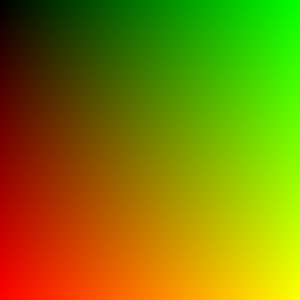

- Illustrates the concept of a framebuffer
- Framebuffer memory management is manual
- Simple loops are used to generate a color gradient image
- The framebuffer is saved as a RAW 24bit rgb image
- You can open the image using 2D manipulation software such as [Gimp](https://www.gimp.org)

### raw2_raycast - RayCasting with Phong lighting and shadows

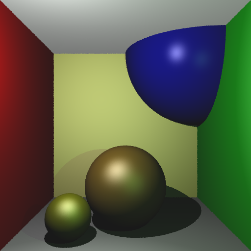

- Simple demonstration of basic ray casting
- Rays are cast from camera space into the scene with multi-sampling
- Collisions are computed with scene geometry and hits are generated
- For each hit the example calculates Phong lighting with shadow term

### raw3_raytrace - RayTracing with reflections and refractions

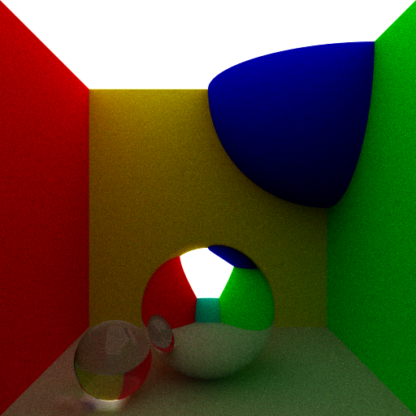

- Simple demonstration of RayTracing without any acceleration techniques
- Casts rays from camera space into scene and recursively traces reflections/refractions
- Materials are extended to support simple specular reflections and transparency with refraction index
- A multi-core CPU is recommended to run the example

### raw4_raster - Raster rendering with texturing

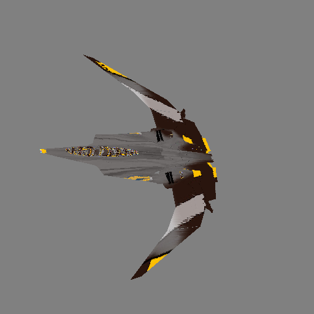

- Implements a very simple software raster rendering
- Mimics parts of the OpenGL pipeline with vertex and fragment shaders
- Some of the pipeline steps such as culling, clipping were skipped for simplicity and readability
- Triangle rendering uses horizontal triangle splitting and filling is implemented using linear interpolation


## OpenGL 3.3 examples
The included OpenGL 3.3 examples will generate graphical output directly onto the screen using a window. Most of the examples rely on the included _ppgso_ library to provide simple abstraction classes such as ppgso::Window or ppgso::Texture. Students are expected to analyse these abstractions and extend them if needed.

### [gl1_gradient](src/gl1_gradient/gl1_gradient.cpp) - Simple triangle with a color gradient

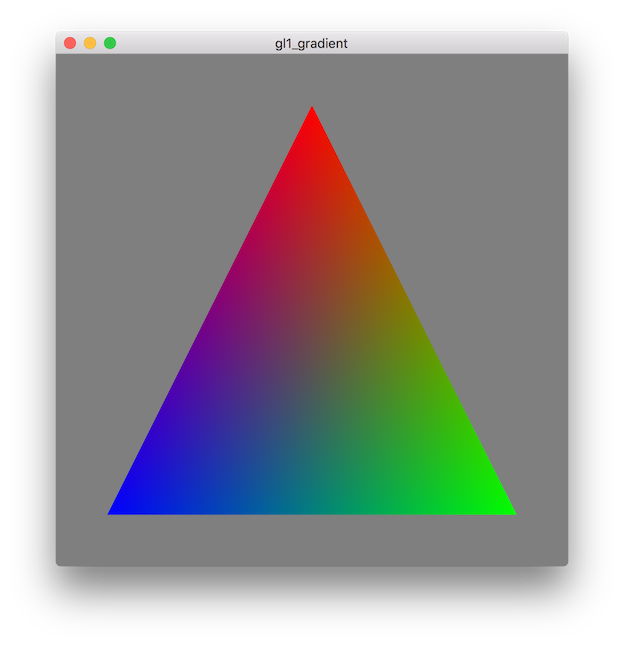

- Recommended example to start with learning OpenGL
- Simple application with direct OpenGL calls, only window handling is abstracted
- Renders a triangle in the center of the screen with color gradinet between its corners

### [gl2_texture](src/gl2_texture/gl2_texture.cpp) - Loading and rendering RAW texture

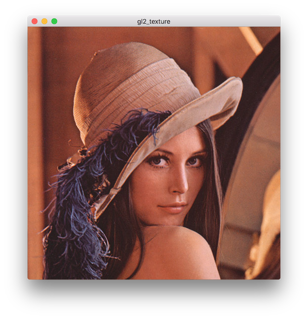

- Demonstrates how to load raw texture data as input for a shader
- The texture itself is loaded from raw RGB image file directly into OpenGL
- Geometry loading is handled using the Mesh class that also handles loading of UV coordinates

### [gl3_animate](src/gl3_animate/gl3_animate.cpp) - Dynamically generated 2D animation

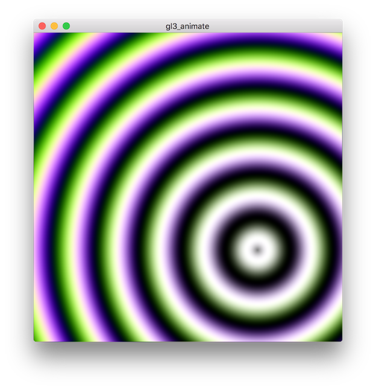

- Demonstrates the use of a dynamically generated texture content on the CPU
- Displays the generated content as texture on a quad using OpenGL
- Basic animation achieved by incrementing a parameter used in the image generation

### [gl4_transform](src/gl4_transform/gl4_transform.cpp) - 2D transformations

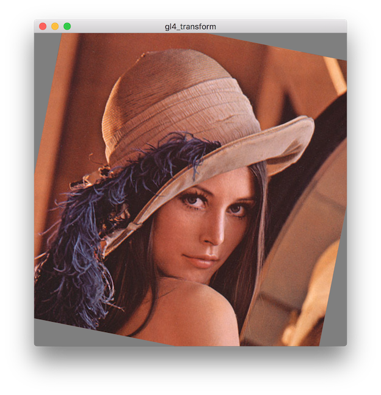

- This example demonstrates basic transformations
- Example combines multiple matrices using multiplication
- Press SPACE to see each transformation

### [gl5_projection](src/gl5_projection/gl5_projection.cpp) - Parallel and perspective projections

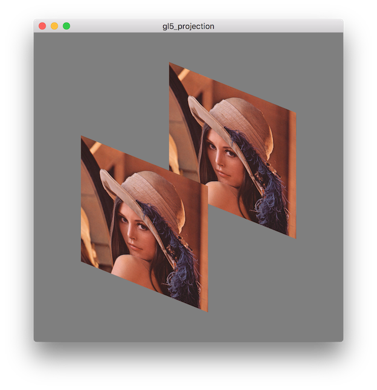

- Demonstrates the use of perspective and parallel projection
- Geometry is rendered in 3D and thus can overlap
- Useful for demonstrating culling and depth test concepts

### [gl6_mesh](src/gl6_mesh/gl6_mesh.cpp) - Loading and rendering 3D models

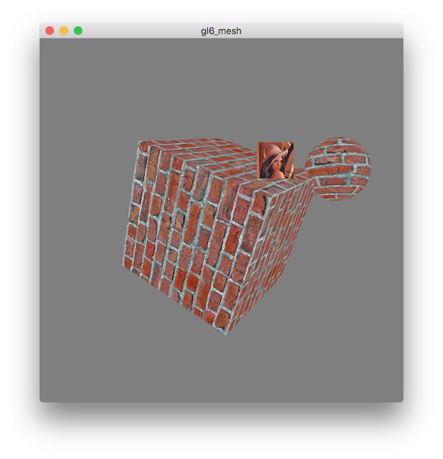

- Displays geometry that is loaded from Wavefront OBJ files encapsulated in a Mesh object
- Implements object transformation based on mouse movement
- Combines parallel and orthographic camera projection
- SPACE stops/resumes the animation

### [gl7_diffuse](src/gl7_diffuse/gl7_diffuse.cpp) - Directional light with diffuse lighting

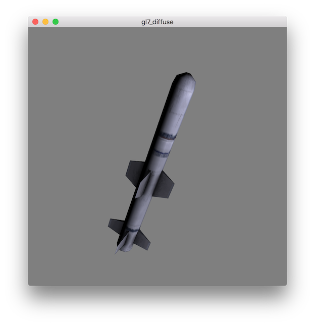

- Demonstration of simple diffuse lighting with one directional light source
- The light direction can be randomised by pressing SPACE

### [gl8_framebuffer](src/gl8_framebuffer/gl8_framebuffer.cpp) - Two pass rendering with a convolution filter

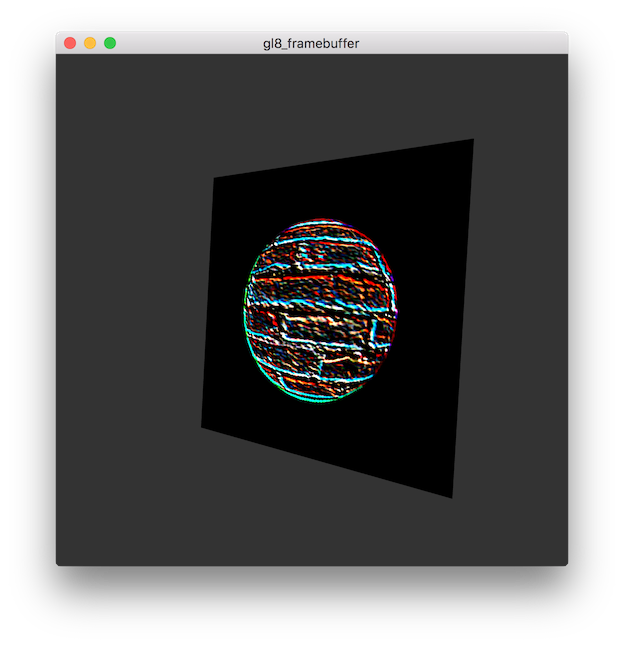

- Demonstrates use of Framebuffer Object (FBO)
- Renders a scene to a texture in graphics memory
- The resulting texture is used in the final scene displayed on screen with a convolution filter applied

### [gl9_scene](src/gl9_scene/gl9_scene.cpp) - Game with interactive scene

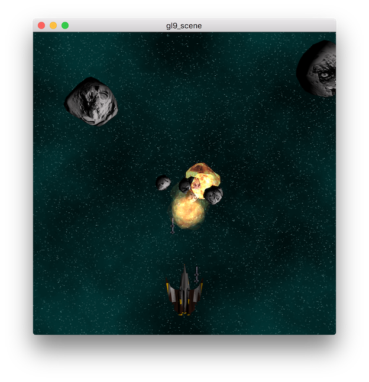

- Introduces the concept of a dynamic scene of objects
- Uses abstract object interface for _Update_ and _Render_ steps
- Creates a simple game scene with Player, Asteroid and Space objects
- Some objects use shared resources and all object deallocations are handled automatically
- Controls: LEFT, RIGHT, "R" to reset, "P" to pause, SPACE to fire

## Task templates for courses


## Installation instructions

The recommended way to build and explore the examples is to use the [CLion IDE](https://www.jetbrains.com/clion/) which is available for macOS, Linux and Windows. It is free for 30days and you can register for a [FREE LICENSE](https://www.jetbrains.com/student/) using university mail.

Depending on your system of choice you will need to install the following dependencies:
* C++14 capable compiler
* [CMake](https://cmake.org) build system - This is part of the CLion IDE installation
* [GLEW](http://glew.sourceforge.net) - The OpenGL Extension Wrangler Library for compatibility reasons
* [GLFW3](http://www.glfw.org) - Platform-independent API for creating windows, reading input, handling events, etc.
* [GLM](http://glm.g-truc.net) - C++ mathematics library for graphics software

You can also use CMake directly to generate project files for many other IDEs, see [Generic CMake instructions](#generic-instructions-for-using-cmake).

### Linux dependencies
On Linux install the following dependencies using your package manager, for example on Ubuntu open your terminal and do:

```bash
sudo apt-get install build-essential cmake libglew-dev libglfw3-dev libglm-dev
```

### Apple macOS dependencies
On macOS install [Homebrew](http://brew.sh) package manager and install the dependencies using the following commands in terminal. Note that the installation of Homebrew expects __XCode__ to be installed, this can be simply downloaded from the app store.

```bash
brew install cmake glm glfw glew
```

You can also install CMake and use it to generate project files for your IDE of choice.

### Microsoft Windows dependencies
On Microsoft Windows you may try to open the `CMakeLists.txt` file with the latest Visual Studio with CMake support. The samples should work as is, binaries for the above mentioned libraries are included as part of the repository.

However the recommended way is to avoid Visual Studio and install [CLion IDE](https://www.jetbrains.com/clion/) and a __GCC__ based compiler:

* Download and install [MinGW-w64](https://sourceforge.net/projects/mingw-w64/), this is the latest GCC compiler for Windows in a nice installer.
* Make sure to install the __64bit version (select x86_64, NOT i686)__, you need to manually switch this in the installer process. 
* To avoid issues with malformed paths also edit the installation destination to C:/mingw-w64 instead of Program Files.
* Run CLion and select MinGW as the __toolchain__ when prompted (default is C:/mingw-w64/..)
* Setup the rest of the settings as you see fit.
* Open this directory and point the IDE towards the `CMakeLists.txt` file.

If CLion is too resource intensive for your system you can also try [QTCreator IDE](http://www.qt.io/ide/) that should work out of the box with MinGW and CMake.

Another alternative is to use Visual Studio 2017 with CMake support included, with this version you can open the CMakeLists.txt file directly as any other project.

## Running the examples

Regardless of the IDE of your choice you will need to manually set the __working directory__ for each sample in the IDE.

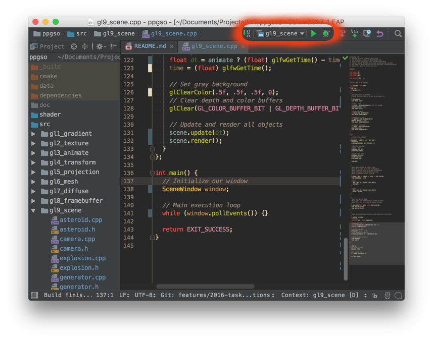

To do so in CLion click the top right button that allows you to switch targets. The selection menu will also contain _"Edit configurations"_ option that will allow you to set additional properties for each target.

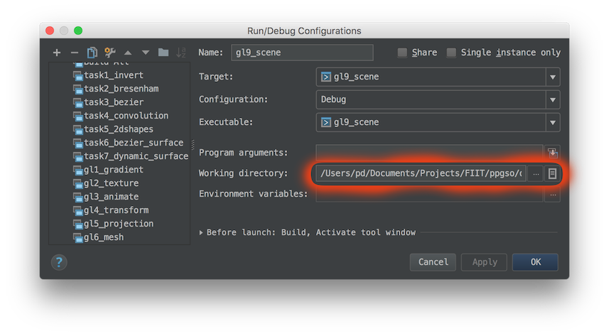

Here you can browse to the [data](data) folder, you can then copy paste the path to other targets which can be switched on the left size of the window.

## Generic instructions for using CMake

Using CMake from command-line you can generate the project files as shown below. The placeholder [YOUR_GENERATOR] should be replaced with the generator appropriate for your IDE/environment. Usually removing the option entirely will generate the default for the given platform. To find out all available generators just run `cmake --help`

```bash
cd ppgso
mkdir _build && cd _build
cmake .. -G"[YOUR_GENERATOR]"
cmake --build . --target install
```

Depending on available dependencies and their installation sometimes CMake might not be able to automatically find them. You can however point CMake to the required dependencies manually by setting command-line options such as GLEW_INCLUDE_DIRS which should point to the headers of the GLEW library that you want to use. Same principle applies for other dependencies. You can alternatively use CMake GUI (cmake-gui .) and point it to the work directory, it will allow you to edit the variables more comfortably.

```bash
cd ppgso/_build
cmake .. -DGLFW_INCLUDE_DIRS="C:\libs\glfw3\include" -DGLFW_LIBRARIES="C:\libs\glfw3\glfw3.dll"
cmake --build . --target install
```

After installation the files should be installed into a new `_install` subdirectory. You can then run the examples as follows:

```bash
cd ppgso/_install
./gl_gradient
```

## Common pitfalls
#### Windows pitfalls
On Windows NEVER store projects in paths and directories that contain spaces or non-ascii characters.

If you are unfortunate enough to have a Windows username with non-ascii characters then your builds will fail unless you edit CLion configuration manually as follows:

```
# Edit idea.properties file in CLion install directory and add
idea.system.path=C:/clion/system
# Make sure the directory exists
```

#### My linux does not have OpenGL, missing -lGL
Try to install `mesa-common-dev`, `libgl1-mesa-dev` and `libglu1-mesa-dev`

## Links and Documentation
- GLM [official documentation](http://glm.g-truc.net/0.9.7/api/a00162.html) and [samples](http://glm.g-truc.net/0.9.7/code.html)
- GLFW [official documentation](http://www.glfw.org/docs/latest/) and [guide](http://www.glfw.org/docs/latest/quick.html)
- GLEW [use guide](http://glew.sourceforge.net/basic.htm)
- CMake [basic use](https://cmake.org/runningcmake/) and [tutorial](https://cmake.org/cmake-tutorial/)
